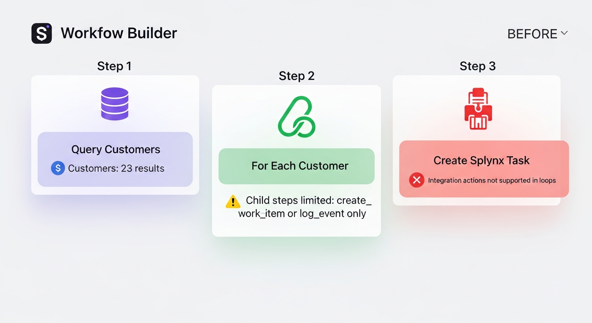
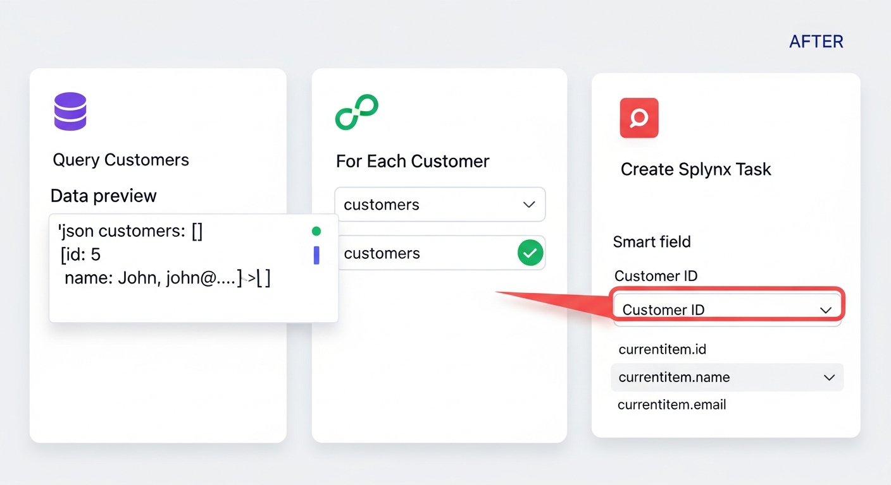
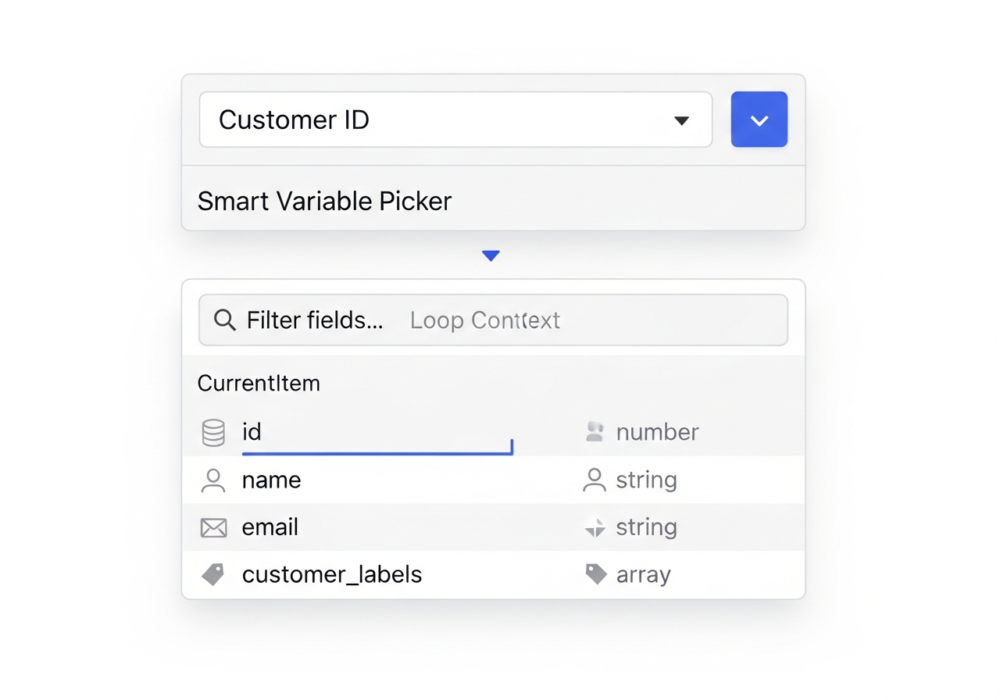
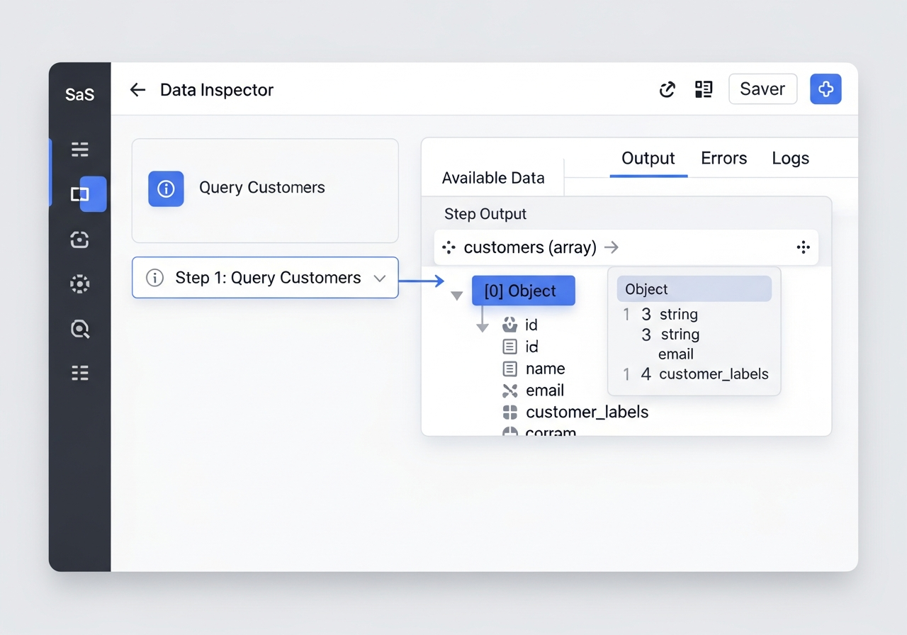

# Workflow For-Each Loop Enhancement Plan
**Version:** 1.0  
**Date:** November 18, 2025  
**Status:** Awaiting Approval - NO CHANGES MADE YET

---

## 📋 Executive Summary

**User Problem:** Cannot create Splynx tasks inside for-each loops when iterating over customer records. The UI blocks integration actions and shows an unhelpful error message.

**Root Cause:** The UI intentionally blocks integration actions in child steps, even though the backend executor already calls `executeStep()` which should theoretically support them.

**Solution:** Enable integration actions in loops with enhanced variable substitution and user-friendly data context awareness.

**Risk Level:** 🟡 MEDIUM - Backend changes are low risk (already calls executeStep), but we need to add variable substitution for parameters and improve UX significantly.

---

## 🎯 Current State Analysis

### ✅ What Works Today (MUST PRESERVE)

#### 1. For-Each Loop Execution (Backend)
**File:** `server/services/workflow/WorkflowExecutor.ts` Lines 1423-1496

```typescript
// ✅ WORKING CODE - Creates scoped context correctly
const scopedContext = {
  ...context,           // Parent context (organizationId, userId, etc.)
  currentItem,          // Current array item
  currentIndex: i,      // Loop index
};

// ✅ WORKING CODE - Calls executeStep for child steps
const result = await this.executeStep(childStep, scopedContext);
```

**What This Means:**
- Loop executor creates proper scoped context with `currentItem` and `currentIndex`
- Calls `executeStep()` which routes to ALL step types including `integration_action`
- Already handles success/error counting and logging
- **This already works - we just need to enable it in the UI!**

#### 2. Variable Substitution (Backend)
**File:** `server/services/workflow/WorkflowExecutor.ts` Lines 1376-1387

```typescript
// ✅ WORKING CODE - Template variable substitution
private processTemplate(template: string, context: any): any {
  return template.replace(/\{\{(\w+(?:\.\w+)*)\}\}/g, (match, path) => {
    return this.getNestedValue(context, path) || match;
  });
}

// ✅ WORKING CODE - Nested property access
private getNestedValue(obj: any, path: string): any {
  return path.split('.').reduce((current, key) => current?.[key], obj);
}
```

**What This Means:**
- `{{currentItem.id}}` → resolves to the actual customer ID
- `{{currentItem.name}}` → resolves to the customer name
- Works for nested properties: `{{currentItem.customer_labels.0.label}}`
- **This already works - used in create_work_item steps!**

#### 3. Integration Action Execution (Backend)
**File:** `server/services/workflow/WorkflowExecutor.ts` Lines 521-567

```typescript
// ✅ WORKING CODE - Integration actions at root level
private async executeIntegrationAction(step: any, context: any) {
  // Fetches integration credentials
  // Decrypts them
  // Passes parameters to ActionHandlers
  // Returns result
}
```

**What This Means:**
- Integration actions work perfectly at root level
- Credentials are loaded and decrypted
- Parameters are passed through correctly
- **This already works - just not inside loops!**

### ❌ What Doesn't Work (THE PROBLEM)

#### 1. UI Blocks Integration Actions in Loops
**File:** `client/src/components/workflow/WorkflowStepBuilder.tsx` Lines 972-976

```typescript
// ❌ BLOCKING CODE
{childStep.type === 'integration_action' && (
  <div className="text-sm text-muted-foreground text-center py-2">
    Integration actions in child steps are not yet fully supported.
    Use create_work_item or log_event instead.
  </div>
)}
```

**Screenshot Evidence:**


#### 2. No Variable Substitution in Integration Parameters
**File:** `server/services/workflow/WorkflowExecutor.ts` Lines 521-567

```typescript
// ❌ MISSING CODE - Parameters passed raw, not processed
const result = await this.actionHandlers.executeIntegrationAction(
  integration.platformType,
  action,
  parameters,  // ❌ NOT PROCESSED - {{variables}} not substituted
  credentials,
  context
);
```

**What This Means:**
- When you type `{{currentItem.id}}` in the Customer ID field, it's sent as a literal string
- The `processTemplate()` function exists but isn't called on integration parameters
- This is why your screenshot shows `{{currentItem.id}}` instead of `5`

#### 3. Poor Variable Discovery UX
- Users must manually type `{{currentItem.id}}` without knowing what fields exist
- No autocomplete showing available fields
- No validation that the variable exists until runtime
- No preview of what data looks like from previous steps

---

## 💡 Proposed Solution

### Phase 1: Enable Integration Actions in Loops ⭐ HIGH PRIORITY

#### Backend Changes

**File:** `server/services/workflow/WorkflowExecutor.ts`

```typescript
// 📝 NEW CODE - Add variable substitution for integration parameters
private async executeIntegrationAction(step: any, context: any): Promise<StepExecutionResult> {
  try {
    const { integrationId, action, parameters } = step.config || {};
    
    // ... existing code to fetch integration ...
    
    // ✨ NEW: Process template variables in parameters
    const processedParameters = this.processParametersRecursively(parameters, context);
    
    console.log(`[WorkflowExecutor]   📝 Original parameters:`, parameters);
    console.log(`[WorkflowExecutor]   ✨ Processed parameters:`, processedParameters);
    
    // Execute integration-specific action with processed parameters
    const result = await this.actionHandlers.executeIntegrationAction(
      integration.platformType,
      action,
      processedParameters,  // ✨ CHANGED: Use processed parameters
      credentials,
      context
    );
    
    // ... rest of existing code ...
  }
}

// ✨ NEW HELPER FUNCTION
private processParametersRecursively(params: any, context: any): any {
  if (typeof params === 'string') {
    return this.processTemplate(params, context);
  }
  
  if (Array.isArray(params)) {
    return params.map(item => this.processParametersRecursively(item, context));
  }
  
  if (params && typeof params === 'object') {
    const processed: any = {};
    for (const [key, value] of Object.entries(params)) {
      processed[key] = this.processParametersRecursively(value, context);
    }
    return processed;
  }
  
  return params;
}
```

**Risk Assessment:** 🟢 LOW RISK
- Only adds processing layer, doesn't change execution flow
- Uses existing `processTemplate()` function already tested with create_work_item
- Recursive processing handles nested objects safely
- No database changes required

#### Frontend Changes

**File:** `client/src/components/workflow/WorkflowStepBuilder.tsx`

```typescript
// BEFORE (Lines 870-873):
<SelectContent>
  <SelectItem value="create_work_item">Create Work Item</SelectItem>
  <SelectItem value="integration_action">Integration Action</SelectItem>  {/* ❌ Limited */}
  <SelectItem value="log_event">Log Event</SelectItem>
</SelectContent>

// AFTER: Keep same - integration_action already in dropdown

// BEFORE (Lines 972-976):
{childStep.type === 'integration_action' && (
  <div className="text-sm text-muted-foreground text-center py-2">
    Integration actions in child steps are not yet fully supported.
    Use create_work_item or log_event instead.
  </div>
)}

// AFTER: ✨ NEW CODE
{childStep.type === 'integration_action' && (
  <div className="space-y-3">
    {/* Show integration selection */}
    <div>
      <Label className="text-xs">Integration</Label>
      <Select
        value={childStep.config?.integrationId?.toString() || ''}
        onValueChange={(value) => updateChildStep({
          config: { ...childStep.config, integrationId: parseInt(value) }
        })}
      >
        <SelectTrigger>
          <SelectValue placeholder="Select integration" />
        </SelectTrigger>
        <SelectContent>
          {integrations
            .filter(i => i.platformType === 'splynx') // Show only Splynx for now
            .map(integration => (
              <SelectItem key={integration.id} value={integration.id.toString()}>
                {integration.name} ({integration.platformType})
              </SelectItem>
            ))
          }
        </SelectContent>
      </Select>
    </div>

    {/* Show action selection (reuse existing code from root-level integration action) */}
    {childStep.config.integrationId && (
      <div>
        <Label className="text-xs">Action</Label>
        <Select
          value={childStep.config.action}
          onValueChange={(value) => updateChildStep({
            config: { ...childStep.config, action: value }
          })}
        >
          <SelectTrigger>
            <SelectValue placeholder="Select action" />
          </SelectTrigger>
          <SelectContent>
            <SelectItem value="create_splynx_task">Create Splynx Task</SelectItem>
          </SelectContent>
        </Select>
      </div>
    )}

    {/* Show Splynx task form (reuse existing code from root-level) */}
    {childStep.config.action === 'create_splynx_task' && (
      <div className="space-y-2">
        <div className="p-2 bg-blue-50 dark:bg-blue-950 border border-blue-200 dark:border-blue-800 rounded text-xs">
          💡 Use <code>{{`{{currentItem.fieldName}}`}}</code> to access loop data
        </div>
        
        {/* Task Name */}
        <div>
          <Label className="text-xs">Task Name</Label>
          <Input
            placeholder="e.g., Follow up: {{currentItem.name}}"
            value={childStep.config.parameters?.taskName || ''}
            onChange={(e) => updateChildStep({
              config: {
                ...childStep.config,
                parameters: { ...childStep.config.parameters, taskName: e.target.value }
              }
            })}
          />
        </div>

        {/* Customer ID */}
        <div>
          <Label className="text-xs">Customer ID</Label>
          <Input
            placeholder="e.g., {{currentItem.id}}"
            value={childStep.config.parameters?.customerId || ''}
            onChange={(e) => updateChildStep({
              config: {
                ...childStep.config,
                parameters: { ...childStep.config.parameters, customerId: e.target.value }
              }
            })}
          />
        </div>

        {/* Project ID, Workflow Status, etc. - reuse existing fields */}
      </div>
    )}
  </div>
)}
```

**Risk Assessment:** 🟢 LOW RISK
- Reuses existing UI components from root-level integration actions
- Only removes the blocking message and adds form fields
- No breaking changes to existing functionality

**Screenshot - Proposed UI:**


---

### Phase 2: Smart Variable Picker 🎯 MEDIUM PRIORITY

**Goal:** Replace manual `{{currentItem.id}}` typing with smart autocomplete dropdowns

#### New Component: `VariableFieldPicker.tsx`

```typescript
interface VariableFieldPickerProps {
  value: string;
  onChange: (value: string) => void;
  placeholder?: string;
  availableFields: Array<{
    name: string;
    type: string;
    icon: React.ElementType;
  }>;
}

function VariableFieldPicker({ value, onChange, placeholder, availableFields }: VariableFieldPickerProps) {
  const [isOpen, setIsOpen] = useState(false);
  const [search, setSearch] = useState('');

  // Extract variable name from {{currentItem.field}} format
  const currentField = value.match(/\{\{currentItem\.(\w+)\}\}/)?.[1] || '';

  const filteredFields = availableFields.filter(f =>
    f.name.toLowerCase().includes(search.toLowerCase())
  );

  return (
    <div className="relative">
      <div className="flex gap-1">
        <Input
          value={value}
          onChange={(e) => onChange(e.target.value)}
          placeholder={placeholder}
          className="flex-1"
        />
        <Button
          type="button"
          size="sm"
          variant="outline"
          onClick={() => setIsOpen(!isOpen)}
        >
          <Sparkles className="h-3 w-3" />
        </Button>
      </div>

      {isOpen && (
        <div className="absolute top-full left-0 right-0 mt-1 bg-white dark:bg-gray-800 border rounded-lg shadow-lg z-50 max-h-64 overflow-y-auto">
          <div className="p-2 border-b">
            <Input
              placeholder="Filter fields..."
              value={search}
              onChange={(e) => setSearch(e.target.value)}
              className="text-sm"
            />
          </div>
          <div className="p-1">
            {filteredFields.map(field => (
              <button
                key={field.name}
                type="button"
                className="w-full flex items-center gap-2 p-2 hover:bg-gray-100 dark:hover:bg-gray-700 rounded text-sm text-left"
                onClick={() => {
                  onChange(`{{currentItem.${field.name}}}`);
                  setIsOpen(false);
                }}
              >
                <field.icon className="h-4 w-4 text-gray-500" />
                <code className="flex-1 font-mono">{field.name}</code>
                <span className="text-xs text-gray-500">{field.type}</span>
              </button>
            ))}
          </div>
        </div>
      )}
    </div>
  );
}
```

**Screenshot - Smart Picker:**


**Usage Example:**

```typescript
<VariableFieldPicker
  value={childStep.config.parameters?.customerId || ''}
  onChange={(value) => updateChildStep({
    config: {
      ...childStep.config,
      parameters: { ...childStep.config.parameters, customerId: value }
    }
  })}
  placeholder="Select customer ID field"
  availableFields={[
    { name: 'id', type: 'number', icon: Hash },
    { name: 'name', type: 'string', icon: User },
    { name: 'email', type: 'string', icon: Mail },
    { name: 'customer_labels', type: 'array', icon: Tags },
  ]}
/>
```

**Risk Assessment:** 🟡 MEDIUM RISK
- New component, requires testing
- Must handle edge cases (nested properties, arrays)
- Optional - can be added after Phase 1

---

### Phase 3: Data Inspector Panel 🔍 LOW PRIORITY

**Goal:** Show users what data is available from previous steps

#### New Component: `DataInspectorPanel.tsx`

```typescript
interface DataInspectorPanelProps {
  steps: WorkflowStep[];
  currentStepIndex: number;
}

function DataInspectorPanel({ steps, currentStepIndex }: DataInspectorPanelProps) {
  const [expandedSteps, setExpandedSteps] = useState<Set<string>>(new Set());

  // Get all previous steps that output data
  const dataSteps = steps
    .slice(0, currentStepIndex)
    .filter(step => step.config?.resultVariable);

  return (
    <div className="border-l bg-gray-50 dark:bg-gray-900 p-4 w-80">
      <h3 className="font-semibold mb-3 text-sm">Available Data</h3>
      
      <div className="space-y-2">
        {dataSteps.map(step => {
          const varName = step.config.resultVariable;
          const isExpanded = expandedSteps.has(step.id);
          
          return (
            <div key={step.id} className="border rounded bg-white dark:bg-gray-800 p-2">
              <button
                type="button"
                className="w-full flex items-center gap-2 text-sm"
                onClick={() => {
                  const newExpanded = new Set(expandedSteps);
                  if (isExpanded) {
                    newExpanded.delete(step.id);
                  } else {
                    newExpanded.add(step.id);
                  }
                  setExpandedSteps(newExpanded);
                }}
              >
                <ChevronRight className={`h-3 w-3 transition-transform ${isExpanded ? 'rotate-90' : ''}`} />
                <code className="font-mono font-semibold flex-1 text-left">{varName}</code>
                <span className="text-xs text-gray-500">array</span>
              </button>
              
              {isExpanded && (
                <div className="mt-2 ml-5 text-xs font-mono space-y-1">
                  <div className="text-gray-600 dark:text-gray-400">
                    [{'{'}0{'}'}] Object
                  </div>
                  <div className="ml-3 space-y-0.5">
                    <div className="flex items-center gap-2">
                      <Hash className="h-3 w-3 text-gray-400" />
                      <span>id: <span className="text-blue-600">number</span></span>
                    </div>
                    <div className="flex items-center gap-2">
                      <User className="h-3 w-3 text-gray-400" />
                      <span>name: <span className="text-green-600">string</span></span>
                    </div>
                    <div className="flex items-center gap-2">
                      <Mail className="h-3 w-3 text-gray-400" />
                      <span>email: <span className="text-green-600">string</span></span>
                    </div>
                  </div>
                </div>
              )}
            </div>
          );
        })}
      </div>
      
      {dataSteps.length === 0 && (
        <p className="text-sm text-gray-500 text-center py-4">
          No data available from previous steps
        </p>
      )}
    </div>
  );
}
```

**Screenshot - Data Inspector:**


**Risk Assessment:** 🟢 LOW RISK
- Optional enhancement, doesn't affect core functionality
- Can be added incrementally
- Improves UX significantly but not required for basic functionality

---

## 🧪 Testing Strategy

### Phase 1 Testing (Critical)

#### Test Case 1: Basic Loop with Task Creation
```
Step 1: Query Splynx customers with label "aimee"
  → Result variable: customers
  → Expected: Returns array of 3 customers

Step 2: For Each customer in customers
  └─ Create Splynx Task
     - Task Name: "Follow up: {{currentItem.name}}"
     - Customer ID: {{currentItem.id}}
     - Project ID: 3
     - Workflow Status ID: 24

Expected Result:
✅ 3 Splynx tasks created
✅ Task names: "Follow up: John", "Follow up: Sarah", "Follow up: Mike"
✅ Each task linked to correct customer ID (5, 12, 18)
✅ No errors in execution log
```

#### Test Case 2: Variable Substitution in All Fields
```
Step 2 Child Step:
  - Task Name: "{{currentItem.name}} - Retention Call"
  - Description: "Customer ID: {{currentItem.id}}, Email: {{currentItem.email}}"
  - Address: "{{currentItem.street_1}}, {{currentItem.city}}"

Expected Result:
✅ All fields properly substituted
✅ Task description contains actual customer data
✅ Address field populated from customer record
```

#### Test Case 3: Error Handling
```
Test with invalid variable: {{currentItem.nonexistent}}

Expected Result:
✅ Variable remains as literal "{{currentItem.nonexistent}}"
✅ Task still created (doesn't crash)
✅ Log shows warning about unresolved variable
```

### Phase 2 Testing (Optional)

#### Test Case 4: Smart Variable Picker
```
User Action:
1. Click sparkle button next to Customer ID field
2. See dropdown with: id, name, email, customer_labels
3. Click "id"

Expected Result:
✅ Field auto-fills with "{{currentItem.id}}"
✅ Dropdown closes
✅ Value saved to step config
```

---

## 📊 Implementation Timeline

### Phase 1: Core Functionality (2-3 hours)
- [ ] Backend: Add `processParametersRecursively()` helper
- [ ] Backend: Update `executeIntegrationAction()` to process parameters
- [ ] Frontend: Remove blocking message from child steps
- [ ] Frontend: Add integration action form to child steps (reuse existing)
- [ ] Testing: Run all 3 critical test cases
- [ ] Documentation: Update replit.md with new capability

### Phase 2: Smart Variable Picker (3-4 hours)
- [ ] Create `VariableFieldPicker` component
- [ ] Extract field schema from query results
- [ ] Integrate picker into task creation form
- [ ] Add keyboard navigation support
- [ ] Testing: Manual testing of autocomplete

### Phase 3: Data Inspector (2-3 hours)
- [ ] Create `DataInspectorPanel` component
- [ ] Add collapsible section to workflow builder
- [ ] Wire up data from previous steps
- [ ] Add copy-to-clipboard for variable names
- [ ] Testing: Visual testing with multiple workflows

**Total Estimated Time:** 7-10 hours

---

## ⚠️ Risk Assessment & Mitigation

### Risk 1: Breaking Existing Workflows 🔴 HIGH IMPACT
**Mitigation:**
- Only add processing layer, don't change execution flow
- Test with existing workflows that DON'T use loops
- Add feature flag if needed

### Risk 2: Variable Substitution Edge Cases 🟡 MEDIUM IMPACT
**Mitigation:**
- Handle arrays: `{{currentItem.customer_labels.0.label}}`
- Handle undefined: Return original `{{variable}}` if not found
- Add extensive logging for debugging

### Risk 3: Performance with Large Arrays 🟡 MEDIUM IMPACT
**Mitigation:**
- Add rate limiting for integration actions in loops
- Show warning if loop has >100 items
- Consider batch mode for future enhancement

### Risk 4: UI Complexity 🟢 LOW IMPACT
**Mitigation:**
- Phase 1 only adds what's necessary
- Phase 2/3 are optional enhancements
- Keep existing UI patterns

---

## 🎯 Success Criteria

### Phase 1 (Minimum Viable)
✅ User can create Splynx tasks inside for-each loops  
✅ Variables like `{{currentItem.id}}` are substituted correctly  
✅ All existing workflows continue to work  
✅ No breaking changes to database or API  

### Phase 2 (Enhanced UX)
✅ Users can select fields from dropdown instead of typing  
✅ Variable picker shows type hints (number, string, array)  
✅ Autocomplete filters as user types  

### Phase 3 (Premium UX)
✅ Users can see available data from previous steps  
✅ Data structure is clearly visualized  
✅ Copy-paste variable names with one click  

---

## 📝 Files to Modify

### Phase 1 (Required)
1. **server/services/workflow/WorkflowExecutor.ts**
   - Add `processParametersRecursively()` method
   - Update `executeIntegrationAction()` to call it
   - ~20 lines of new code

2. **client/src/components/workflow/WorkflowStepBuilder.tsx**
   - Remove blocking message (lines 972-976)
   - Add integration action form to child steps
   - Reuse existing Splynx task form components
   - ~150 lines (mostly copy-paste from existing code)

### Phase 2 (Optional)
3. **client/src/components/workflow/VariableFieldPicker.tsx**
   - New component
   - ~120 lines

### Phase 3 (Optional)
4. **client/src/components/workflow/DataInspectorPanel.tsx**
   - New component
   - ~100 lines

---

## 🔒 Backward Compatibility

**Guaranteed Safe:**
✅ All existing workflows continue to work unchanged  
✅ No database migrations required  
✅ No API changes  
✅ Only additive changes (new features, not modifications)  

**Why It's Safe:**
- Variable substitution only applies to strings with `{{}}` syntax
- Existing hardcoded values pass through unchanged
- Loop execution already works, we're just enabling UI
- Integration actions already work at root level

---

## 💡 Future Enhancements (Out of Scope)

1. **Batch Mode:** Execute integration actions in batches of 10 to avoid rate limits
2. **Dry Run Preview:** Show what will be created before running workflow
3. **Visual Flow Diagram:** Show data flow between steps graphically
4. **Template Library:** Pre-built templates for common use cases
5. **Validation Builder:** Define validation rules for variables before execution

---

## ✅ Approval Checklist

Before implementation, please confirm:

- [ ] I understand what currently works and what will break
- [ ] The UI mockups match my expectations
- [ ] The phased approach makes sense (Phase 1 first, others optional)
- [ ] The timeline is acceptable (7-10 hours total)
- [ ] The risk mitigation strategies are adequate
- [ ] The testing plan covers my use case

**Approved by:** _________________  
**Date:** _________________  
**Phase(s) to implement:** [ ] Phase 1  [ ] Phase 2  [ ] Phase 3

---

## 📞 Next Steps

1. **Review this plan carefully**
2. **Ask questions about anything unclear**
3. **Approve which phases to implement**
4. **I will begin implementation** with Phase 1 to unblock your immediate need

**Your specific use case will work after Phase 1:**
```
Step 1: Query customers with label "aimee" → stores array in "customers"
Step 2: For each customer in customers:
  └─ Create Splynx Task
     - Customer ID: {{currentItem.id}}  ✅ Will resolve to actual ID
     - Task Name: "Aimee retention: {{currentItem.name}}"  ✅ Will work
```
